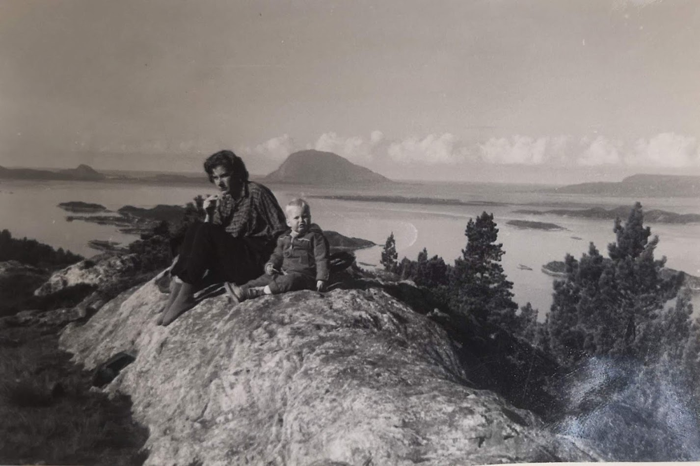

# Knut #

Filosofen Arild Haaland, sa at gleden ved livet ikke var å ligge på ryggen og nyte livet. Den virkelige gleden i livet ligger i å anstrenge seg. Den lekende Håland sluttet aldri å være nysgjerrig og forundre seg over livet som var en stor lekestue

Jeg er halvt Sunnmøring og halvt Nordlending og har vært strandet i Bergen siden 1980. Jeg er født i Ålesund, da min far er fra Brattvåg hvor min farfar og broren var med å bygge opp tettstedet som smed og maskinarbeider.
 Farfar kom fra  <a target="_blank" rel="noopener noreferrer" href="https://slive.no/her-startet-det-industrielle-miljoet-pa-sunnmore/14795?fbclid=IwAR1v3xqLh4JK750eFp2Lrc8IyR2bW5gcjrW4yVhlywnlQJTgrzjF9QGf0_c"> Bjørnevika </a> i Storfjorden hvor familien i flere generasjoner har arbeidet som gårbruker, smed og våpensmeder med bla. utdanning på Kongsberg på starten av attenhundre  <a target="_blank" rel="noopener noreferrer" href= "https://no.wikipedia.org/wiki/Kongsberg_V%C3%A5penfabrikk#Oppstarten_1814"> Kongsberg våpenfabrikk Wikipedia </a>

 Min farmor som kom fra <a target="_blank" rel="noopener noreferrer" href= "https://www.nordoy.net/oyahistorie/">Flemsøy/Skuløya </a> på Sunnmøre var en typisk fisker og småbruks familie. Når hun var liten mistet hun faren og de to eldste brødrene på havet og måtte settes bort for familien hadde ikke råd til å fø på henne.

 Min mor kommer fra Hadsel kommune i Nordland hvor hun vokste opp i smale kår da faren omkom på havet når han skulle sikre lasten i storm over Nordsjøen
 Mormor er født på Hadselsand i Hadsel kommune hvor familien har drevet gårdsbruk i generasjoner. 
 Min morfar kom fra en fiskerfamilie med 12 unger. Det blir fortalt at min tippoldefar kom fra Alversund i Alvær kommune og reiste nordover stiftet familie og arbeidet som fisker. Huset overtok han etter kompisen som omkom på havet med hele mannskapet. Grunnen til at min tippoldefar ikke var med skyltes at han hadde fått verkefinger og måtte hvile.

<h1>Den moderne rallaren </h1>
Før i tiden ble en hos samme arbeidsgiver livet ut. Mange begynte der i sent i tenårene, lærte faget og var lojal mot sin arbeidsgiver som også ofte tok et moralsk ansvar for å sikre sine medarbeidere. Mange steder jeg har vært de siste årene går disse medarbeiderne av med pensjon og blir erstattet av unge mennesker med en masterudtanning. 
 På min reise som platarbeider, Sandblåser/ sprøytemaler og IT medarbeider har jeg arbeidet for et mange ulike bedrifter og bransjer og truffet hundrevis av medarbeidere. Noe av det som har vært mest spennende med denne omflakkingen har vært å få studert ulike arbeidskulturer og arbeidsmetodikker på godt og vondt.
 

Som 17 åring begynte jeg på et lite skipsverft i Florø som hjelpearbeider. Her laget vi skipsluker og dobbelbunner. Jeg arbeidet også som sandblåser og sprøtemaler.  Før jeg begynte på Bergen Ingeniørhøyskole arbeidet jeg også på utrusningen i Ankerløkken Florø, beddingen i Ankerløkken Førde og en tur til Leirvik sveis hvor vi laget boligmoduler til oljeplattformer.

Størstedelen av arbeidslivet har jeg arbeidet innen IT. Jeg  er utdannet dataingeniør fra Høgskolen i Bergen. Jeg har arbeidet for en hel rekke ulike selskaper som Bergen Bank, DNB, Maskinfabrikken hordvikneset, Telenor, Novit, Tryg, BMV-Engeenering, 
Vesta Hygea, Skandiabanken, ISS, Nordea, Adecco, Bergen Data Consulting og nå som konsulent for Ulriken Consulting. 
Jeg har over 20 års erfaring innen bank sektor med ansvar for utvikling, drift og forvaltning av ulike IT løsninger. Jeg har i mange år arbeidet i grensesnittet mellom IT og forretning med å omdanne forretningskrav til IT løsninger. 
Bakgrunnen burde gjør meg til en god rådgiver innen utviklingsoppdrag, Business Intelligens, automatisering av arbeidsprosesser og digitalisering. 
Har også praktisk erfraing fra agile metodikker, Prince2, LEAN m.fl. 
Det er blidt sakt at jeg tilfører høy kunnskap, arbeidskapasitet, god samhandling og ikke minst meget godt humør. 
De siste årene har jeg arbeidet i et internasjonalt miljø med IT-leveranser fra mange ulike sourcing partnere (TCS, Accenture, Evry, Nets). 

<h2>Faglig Spisskompetanse</h2>
Helt siden jeg var liten har jeg elsket å lage ting. Som liten drømte jeg nok om å få lov å bygge hus, båter, jernbane og infrastruktur. Min far foret meg med legoklosser som jeg elsket å leke med. Denne WEB siten er nok et utslag av min skaperglede. Den er laget ved hjelp av React vertøyet Gatsby

<ul>
  <li>Har arbeidet i over 20 år i norges største bank. Erfaring med  utvikling, drift og forvaltning av banker sine kjerneløsninger.</li>
  <li>Har arbeidet som Business analyst og beskrevet forretning sine kravs i kravdokumenter eller som agile User Story,User Case.</li>
  <li>Business Intelligence, Datavarehus  </li>
  <li>Prosjektledelse (Prince2 Sertifisert)</li>
  <li>Kravspesifisering (Forretning og IT-Teknisk)/ Prosess forbedringer </li>
  <li>Meget god kjennskap til prosjektstyringsverktøy verktøy som Jira, SharePoint, Confluence, Zephyr (test)</li>
  <li>IT-Forvaltning (ITIL –Sertifisert)</li>
  <li>Utvikler, BI, Oracle, Unix , Azure, SQL, C#, VB, Microsoft teknologi, SOA tjenester </li>
  <li>Gatsby basert </li>
 </ul>

  <h1>Fjellet</h1>
 Som liten var jeg aldri interessert i idrett, det var ikke noe tema i min familie. Viste knapt hva en fotball var og eide ikke en selv før jeg var ca 16 år. Som 16 ble jeg med en kompis på trening og satt første kamp på benken og dermed var den karrieren over. Min første sykkel fikk jeg derimot som 6 åring og etter det har sykling alltid vært en del av livet.

 Allerede før jeg kunne gå ble jeg tatt med på lange fjellturer. I barneårene bodde jeg i Hammerfest og vinterstid var det obligatorisk lange skiturer hver søndag. I tenårene ble jeg tatt med på påsketur på gamle Turtagrø hotell.  Da jeg tilbrakte ungdomsårene i Sunnfjord, ble det en del turer på de traktene.   I starten av 20 årene tilbrakte jeg hver påske fra hytte til hytte med noe telting i Jotunheimen.  Deretter har jeg disponert hytte i over 10 år på Geilo, før jeg fikk meg en egen hytte på Filefjell. Herfra har jeg endeløse vidder å traske av gårde på vinterstid. Om våren og sommeren har jeg kun 30-60 minutters kjøring til Falketind, Urdanostinden, Eidsbugarden, Utladalen, Hurrunganes

Linker: https://no.wikipedia.org/wiki/Dyrkorn_kraftverk