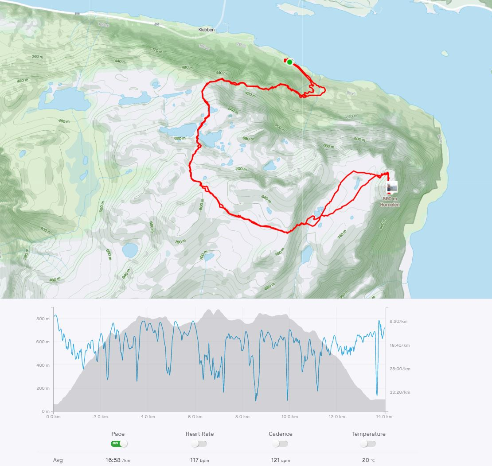
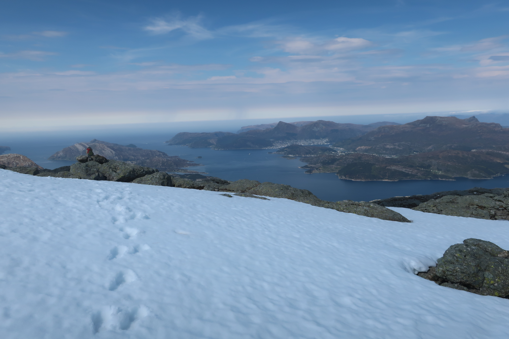

<h1>Hornellen Europas høyeste sjøklippe 860 moh</h1>

Når man kommer med båt langs den indre leie forbi Bremangerlandet og passerer Skatestraumen ligger den der som en majestet hengende utover havet. 
Jeg har hatt mange båtturer mellom Florø og Måløy hvor vi har passert Hornellen. Da har vi ofte sittet på dekk
og sett opp på sjøklippen hvor sagnet sier at  Kong Olav Tryggvason ble så fasinert at han klatret rett opp og festet skjoldet så skulle hans våpendragere hente det ned. 

Der er i dag to merkede T ruter som benyttes til toppen. Den ene starer fra Berleneset og den andre fra Hunskår. 
Jeg elsker motbakker slik at jeg valgte turen fra Hunskår som har nærmere 1200 meter med stigning. Dette er også den raskeste veien til topps. I bildet under ser dere min rute.

Der er en stor parkeringsplass ved gravkapellet ved Hundskår. 
Starten av stien er godt merket sørover langs med sjøen. 
Stien går raskt over i en steintrapp de første 50 høgdemeterne for så å gå over i terrenget. 
I starten er der bløtt med mye vann så en kan med fordel benyttet ordentlig fottøy og ikke joggesko som undertegnede. 
Den første delen av ruten er bratt, og en får raskt utsikt over nordover mot Måløy og Stadlandet.

Kan også nevne at en passerer flere vann på turen slik at en kan fylle på eventuelle drikkeflasker. 

<image src="../../images/hornellen/Moloyihorisonten.jpg" alt="Olavsbu" style="width:300px"> </image>

På toppen av Hornellen har de laget en nødbu, Olavsbu
<image src="../../images/hornellen/Olavsbu.jpg" alt="Olavsbu" style="width:500px"> </image>

Video med utsikt mot sør:

<iframe width="560" height="315" src="https://www.youtube.com/embed/E_CDp4hR8LE" title="YouTube video player" frameborder="0" allow="accelerometer; autoplay; clipboard-write; encrypted-media; gyroscope; picture-in-picture" allowfullscreen></iframe>

Jeg tok turen i midten av mai. Da er det ofte mye snø liggende over 500 meter selv her ute på kysten. Snøen ligger mellom store steiner så det er fort gjort å gå igjennom snøen å skade seg. 

Olavsbu nødbu på toppen  </img>

<h1>Hvor lang tid vil jeg bruke på denne turen.</h1>
Der er ulike tidsangivelser hvor lang td det tar å gå denne turen alt fra 4 timer til 10 timer. Dette kommer helt an på formen. Der er 1200 høydemeter og ca 14 km lengde.
Rekorden på et av Strava segmentene er 1:02 
Jeg klarte ikke å treffe dette segmentet men Strava flyttet meg inn på Segmentet 
<a target="_blank" rel="noopener noreferrer" href= "https://www.strava.com/segments/25099137?filter=overall">Hunsgår til Hornellen </a> 
hvor jeg kom meget bra utav. 

Jeg brukte 1:45 opp til toppen og hadde 30 minutter pause før jeg returnert og brukte ca. 2:15 timer ned igjen. 
Hvis jeg hadde gått i rolig fart ville turen tatt ca 3 timer opp og kanskje litt under ned igjen totalt 6 timer. 
