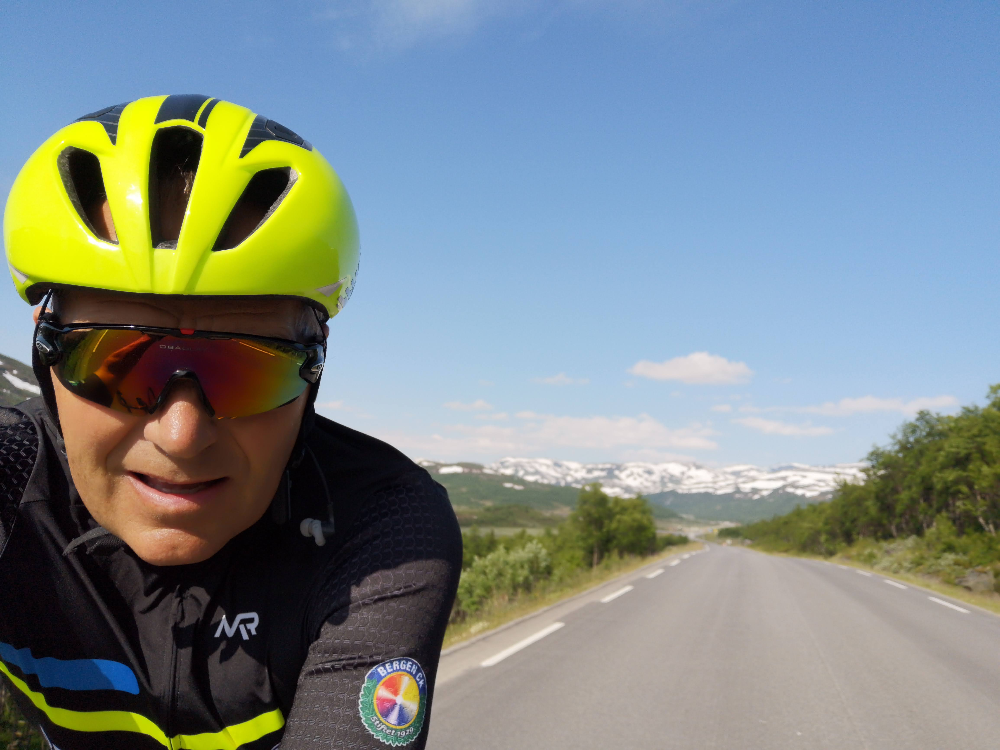

<h1>Sykling fra Filefjell</h1>
For en tursyklist er der et utvalg av naturskjønne turer en kan ta fra Filfjell. Fra korte turer på under timen til en full dagstur på 200 km. 
Hvis en er villig til å benytte bilen til noen transportetapper kan en med under en time finne ulike mål i alle retninger.

bilde 2
<image src="../../../images/Sykkelfilefjell.jpg" alt="Sykkel" style="width:500px"> </image>

Bilde 3
 </img>

<h1>På tur langs med E16</h1>
Når man er på Filefjell er et naturlig valg å følge traseen til E16 og tilhørende sideveier.  Trafikken langs med E16 er ikke så veldig sjenerende selv på sommertid. Er man på tur tidlig morgen eller litt ut på ettermidagen er der enda mindre trafikk.

<h2>Filefjell mot Lærdal</h2>
Fra Filefjell kan man sykle mot Lærdal. Fjellovergangen på filefjell er ca 15 km og ganske flat, der er et par slakke bakketopper og høyesye punkt er ca 1015 moh. Starten de første 15 km går over Filefjell. Her er det laget ny vei i 2018 med en bred veiskulder. 
Når en kommer forbi Maristuen tar over i gamleveien 
Today, we are going to talk about HTML 5. Today, we are going to talk about HTML 5. Today, we are going to talk about HTML 5.
Today, we are going to talk about HTML 5. Today, we are going to talk about HTML 5. Today, we are going to talk about HTML 5.
