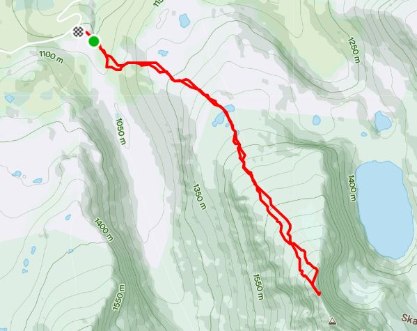

import Carusell from "./dyrhaugstindCarusell.js"

<h1> På Norges tak </h1>
Dyrhaugstind ligger innerst i Sognefjorden som en del av fjellpartiet Hurrungane. Dette området er indrefilen av norske fjell. Her er topper for alle amisjonsnivåer, fra den utrente til de som ønsker å henge i fjellveggen med et tau rundt livet å komme på toppen.
Selv liker jeg best de toppene som jeg kan betige på beina uten noen form for sikring.

Her er dyrhugstind perfekt, man kan bestige toppen sommerstid uten sikringsutstyr og de fleste vil kjenne en lite dragsug når de står på toppen av Store Dyrhaugstind.

Her er ruten jeg GPS traking fra min rute til toppen.

Jeg kjørte fra hytten min på Filefjell via Øvre Årdal, Tindeveien og parkerte bilen en kilometer før Turtagrø ved en liten stikkvei opp Ringselvi på ca 1000 moh.
Når du følger bilveien fører den opp til en liten deming som tar deg trygt over Ringselvi.
Deretter er det bare og ta kurs rett mot toppen. Det starter med litt krattskog de første 100 meterne for så å gå over i steinur. 
Steinuren forfølger deg hele veien opp uten at du finner noen gode stier. 
Brukte ganske nøyaktig 2 timer opp i pulsone 2.  Hadde med meg bikka som var ganske så hysterisk hoppet over alt så den ble surret fast i en stokk men jeg gikk alene opp til toppen.
Lit klyving det siste stykket. 

Denne turen passer for alle :-)

## Bilder fra turen.

<Carusell />

