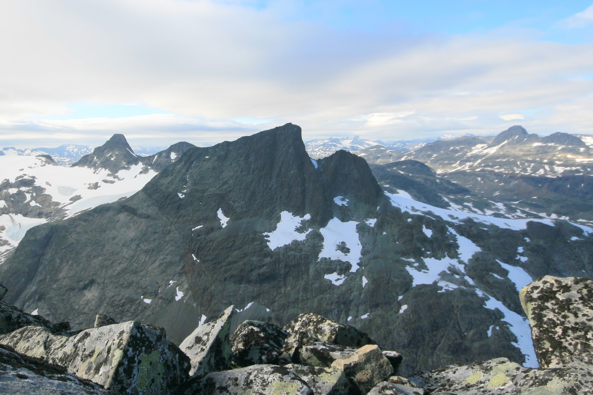

Hjelledalstind 1984 moh.

Hjelledalstind ligger sørvest i Jotunheimen og er det 205 høyeste fjellet i landet. Utgangspunkt for en tur her er kan eks. være Eidsbugarden eller Tyinkrysset.
 Når man ser innover Koldedalen fra parkeringsplassen er Hjelledalstind like så majestetisk som Falketind.  Etter å ha vært på toppen er utsikten minst like imponerende som Falketind.  For de som ikke er opptatt av 2000 meter og ønsker kortere turer er toppen perfekt.

For rolig gange må en regne med ca 5 til 6 timer på den ruten jeg valgte. 
Jeg hadde tidligere prøvd meg på denne toppen men måtte snu for det tok for lang tid grunnet noen feile løypevalg. 

I dag var jeg bedre forberedt og hadde lagt opp til et bedre løypevalg.

Koldedalen med Hjelledalstind og Falketind 

Etter en uke på fjellet i Juli-2013 med mye skyer og  regn var dette første dagen med klarvær slik at motivasjonene var på topp.
Dette ble en kveldstur og jeg ankom bommen ved Koldedalen ca kl 16:00. I starten er der ca 2 km med grusvei så her benyttet jeg min sykkel og fikk også med meg litt terengsykling i det jeg syklet over de to første elvene. Der var fortsatt mye vann i elvene selv om vi nå var kommet til 20 juli.

Sykkelen ble gjemt bakom noen steiner og jeg småjogget videre innover dalen.  Det var flere en meg som var ute på denne fine dagen og der kom smågrupper som hadde vært på Falketind.
Når jeg kom inn til de første kneiken mot Koldedalstind satt jeg farten til rask gange og sånn sone 2 trening oppover ura.
På vei oppover traff jeg en kar med ski på ryggen og tunge slalomstøvler.  Han skulle gå opp snøfonnene mot Koldedalstinden og renne ned igjen.  Han var den eneste siste jeg traff på denne turen.
Veien gikk litt på berg, steinur og på snøfonner. Desto nærmere jeg kom toppen desto brattere ble det og jeg måtte regelrett over til småklatring de siste meterene til topp/bandet mot Koldedalstind.  Der var mye løs stein som var lettbevegelige slik at jeg måtte være forsiktig slik at ikke stener løsnet.
Jeg brukte ca 1:05 på bandet som gikk oppover mot Koldedalstind. Her ble det 5 minutters pause med litt drikke og noen bilder. Jeg tok også på meg vindjakken da det blåste friskt.

Videre oppover bandet gikk greit måtte også spasere over en liten snøfonn med bratte stup på begge sider.

  

Hele veien fra bandet og over Koldedalstind og videre mot Hjelledalstind var der grov ur.
Det var grei klyving  opp mot Koldedalstind, de siste meteren opp mot toppen var der en liten knekk med luftig parti ned mot Koldedalen.
På toppen av Koldedalstind er der et stort platå med flott utsikt i alle himmelretninger.
          

Min GPS rute ca 3 timer i bevegelse.

Ned fra Koldetind mot Hjelledalstind var det grov ur som krever konsentrasjon for å finne de rett plass å sette  beina.
Fra avstand så Hjelledalstind vanskelig ut å bestige men jeg hadde ikke lest noe på nettet om at denne skulle være vanskelig.
Når jeg nærmet meg toppen begynte det å bli ganske bratt og jeg måtte klatre et par partier og lete meg frem til hvor det var best og gå.
Begynte også å kvi meg til nedover turen da jeg så for meg at det ble vanskelig å finne den samme ruten tilbake.  
Under oppstigningen holdt jeg meg helt ut mot kanten av Koldedalen. 
Når jeg endelig nådde toppen blåste det kraftig og det var i ferd med å skye over. Min GPS viser at toppen er på 1919 moh og ikke 1984

Falketind i syningen 

Jeg ble på toppen i ca 10 minutter for å spise og drikke litt av min sparsomme niste, Kvikklunch og vann. Det blåste kraftig på toppen så jeg var glad jeg hadde med meg en vindjakke. Når jeg skulle ned igjen valgte jeg en litt annen rute og mine bekymringer for å ikke komme ned fra selve toppen var ubegrunnet.

På Toppen av Hjelledalstind

Veivalget fra bandet  mellom Hjelldalstind og Koldedalstind ble strake veien ned mot Koldedalen.  Nedenfra dalen ser der bratt ut og der ligger snøfonner hele året som må passeres.  Der var enkelt og ta seg ned så lenge en kunne løpe på snøfonnene.
