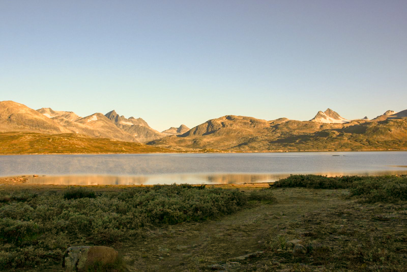
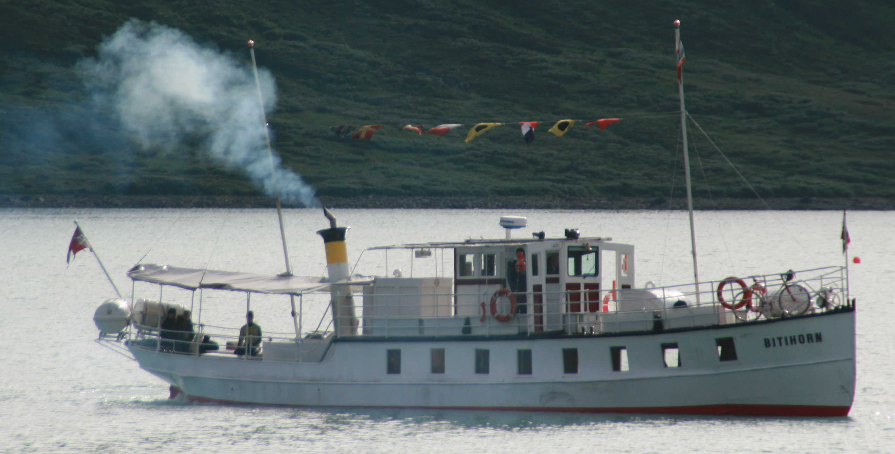

## Eidsbugarden ved Bygdin

Fra midten av juni og ut september kan en benytte grusveien langs med Tyinvann for å sykle inn mot Eidsbugarden.Hvis ikke veien nettopp er gruset kan en fint sykle på racer sykkel. Turen fra veien riksveien mot Årdal og inn til Eidsbugarden er på ca 25 Km.På Eidsbugarden har man turisthytten Fondsbu og det private hotellet Eidsbugarden.   

På veien langs med Tyinvann er der mange flott stopp en kan gjøre i strandkanten. I tillegg til sau kan en hvis en er heldig se både Reinsdyr, rype og en og kanskje en falk som svever over deg. 

Når en sykler langs med Tyin vann vil en etter hvert kunne se både Falketind(2067) og Uranostind(2157)

Fra Eidsbugarden har en utsikt over Bygdin. Herfra går der daglig båt over vannet til Bygdin. En kan ta med sykkelen på båten Bitihorn over til Bygdin. Herfra kan en sykle hjem over Beitostølen og Slettafjellet. 

Hvis en ønsker å forlenge sykkelturen kan en ta de 7-8 km ekstra inn til Koldedalen. Her er veien ofte grovpukket så en må ha ordentlige dekk. Racerdekk holder ikke. Koldedalen er utgangspunkt for fjellturer til Falketind og Uranostind. Husk på at dette er høyfjell og temperaturen kan skifte raskt hvis det skyer til. 