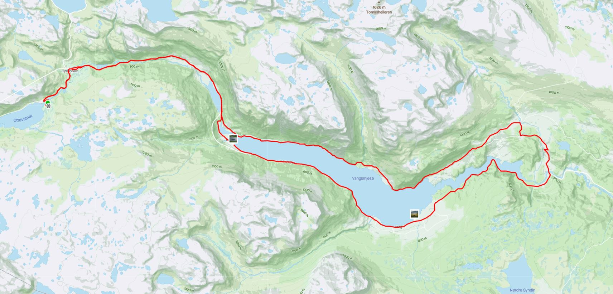
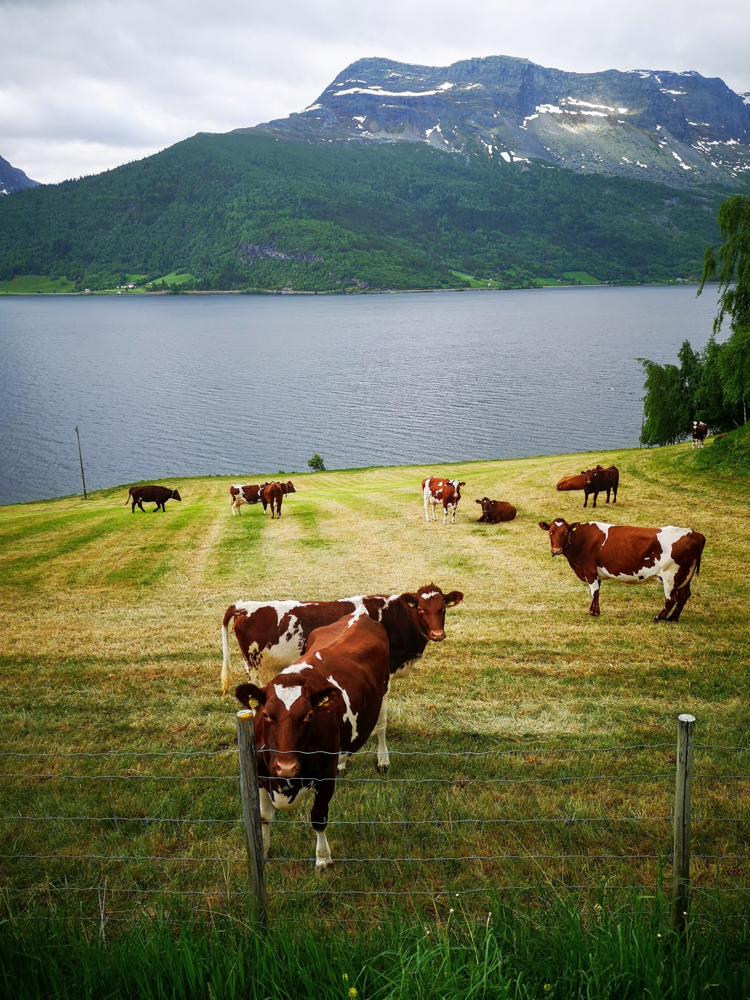
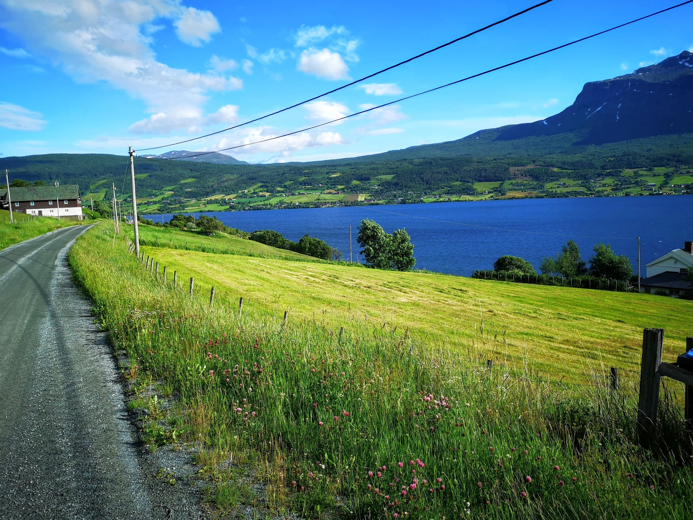
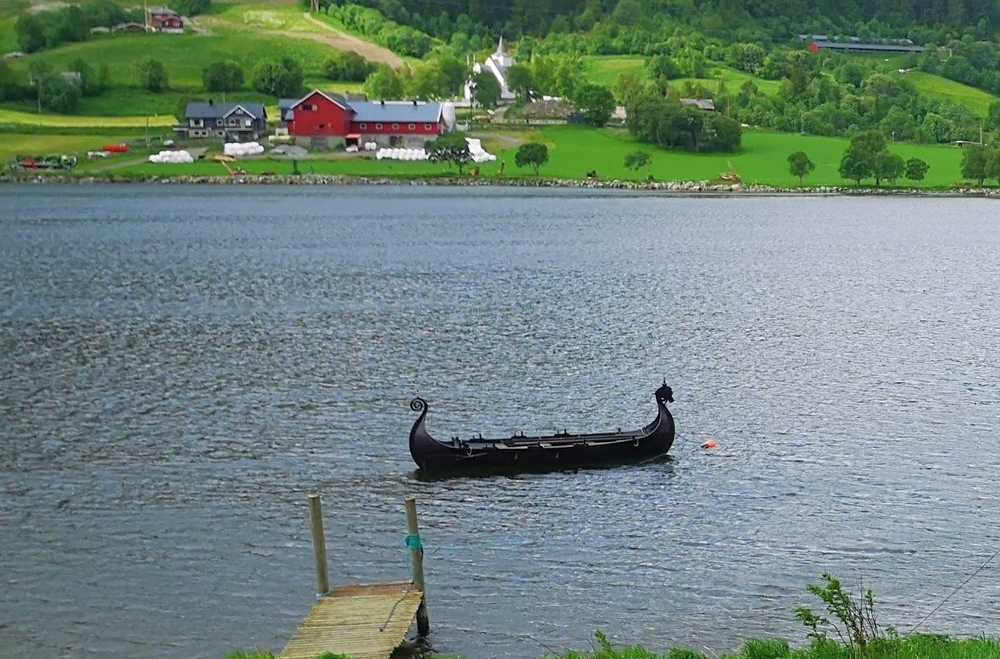

<h2> På sykkel fra Filefjell </h2>
Når man har hytte på Filefjell, er man midt i et værskille mellom øst og Vest. Mine sykkelturer bestemmes ofte av hvor jeg tror det er best vær.
Når solen skinner i vest, tar jeg ofte en runde rundt Vangsmjøsa. Med start på Filefjell følger jeg som oftest E16 østover dalen mot Fagernes. 
Jeg prøver å lage en rundløye hvor lengden bestemmes ut ifra dagsform og tid til rådighet. Dalføret er utformet slik at en enkelt kan variere 
lengden på turen ved å velge ulike vendepunkter som Henning bro(34km), Torpe bro(40km), Kvismoen(43km), Ryfoss(45km) eller Lomen stavkirke(50km). 
Km i parentes er km fra Filefjell. Ved å ta de tre siste avkjøringene får en også med seg Høre stavkirke. 
Vangsmjøsa er nesten 18 km lang. På sørsiden går den asfaltert E16 og på nordsiden er der grusvei som bølger seg opp og ned mellom bjørkeskog og små gårder. 
Om det går fort nedover dalen fra Filefjell halveres snitt farten når man skal hjem igjen. 
Det småkuperte landskapet stjeler fart og hvis grusveien er bløt hjelper det heller ikke på.

Vedlagt ligger kart utsnitt fra en av mine sykkelturer rundt Vansmjøsa og over Torpe Bro som er på ca 40 km fra Filefjell.

<a target="_blank" rel="noopener noreferrer" href= "https://www.strava.com/activities/5455652990/segments/2838730887114190308" 
style={{ color: 'blue' }}> STRAVA Lenke til en av mine turer </a> Der er flere segmenter opp mot Hensåsen 750 moh som en kan bryne seg på. 

På nordsiden ligger der flere gårsdbruk.

På nordsiden av Vangsmjøsa er der en koselig grusvei. Jeg sykler alltid med racer med 25 mm dekk.
 Dette fungerer veldig bra, utenom den dagen veien er nyskrapet noesom skjer en gang i løpet av sommer sesongen.

Man har funnet spor etter mennesklige aktiviteter i Vang som er neste 8000 år gammel .
<a target="_blank" rel="noopener noreferrer" href= "https://www.vang.kommune.no/tenester/utdanning-og-kultur/kultur/kulturminneplan-for-vang/" 
style={{ color: 'blue' }}>
Følg Lenke Tema plan for kulturminne </a>

Området er populært å sykle i og man kan treffe andre syklister her. Dette er midt i løypen til Jotunheime rundt og på en av mine turer traff jeg på en gjeng fra Sogndal sykkel klubb.
På bildet kan dere så vidt skimte dem i bakgrunnen. 

Turen avsluttes med en ordentlig bakke som starer på ca 400 moh og ender på 900 moh ved Otrøvann. 

