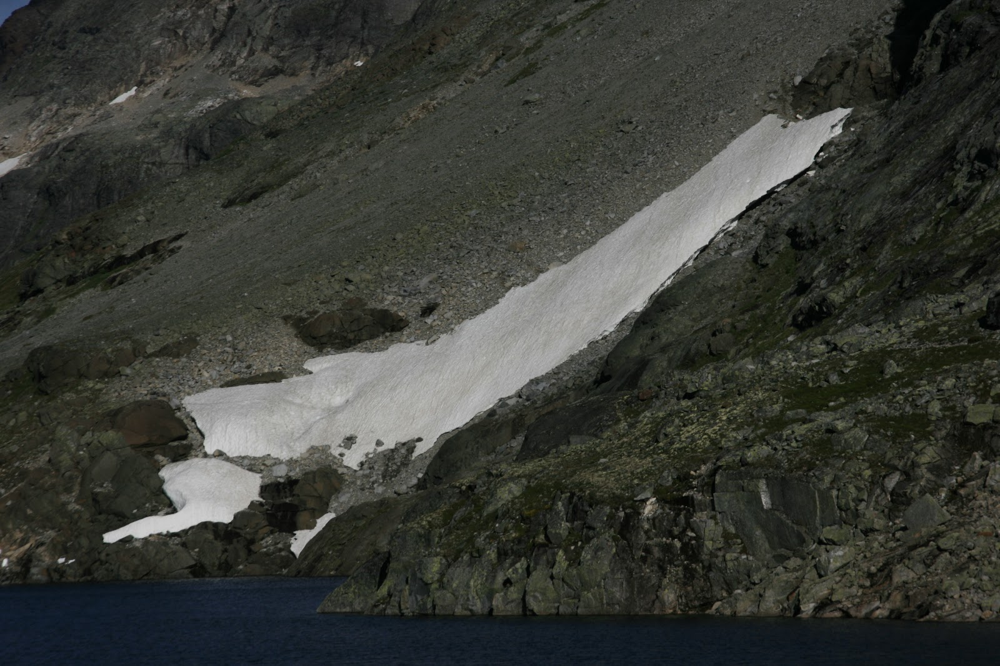

Det burde vært obligatorisk med en tur til Falketind hvert år, dette er en av majestetene i Jotunheimen. 
Vel og merke i godt vær. Temperatur og vær var mer en godkjent på årets tur. Etter fjorårets tur i tykk skodde og regn 
var forventningene store når jeg parkerte bilen innerst i Koldedalen. Jeg skulle gå inn Morka- Koldedalen og opp ved Andrevann.
Hvis det så overkommelig ut for en med høydeskrekk ville jeg også prøve å bestige Stølsnostinden 2075 moh.

Snøfonn som må passeres

Temperaturen var mere en grei nok for T-skjorte og svetten rant når jeg kom frem til det første vannet i Morka Koldedalen.  Dette var min 3 tur til Falketind. Første gangen jeg gikk her i 1994 traff vi på den første utfordringen ved en snøfonn som måtte forseres midt på det første vannet en kommer til. I fjor var denne fonnen helt bort men i år var den kommet tilbake men nå med en fin liten åpning som man kunne forsere. Stien fra Koldedalen og inn Mork-Koldedalen er utydelig vardet en del steder og man må følge med for ikke å miste den av syne. En holder på høyre side av begge vannene en passerer. 

Jeg tok den første pausen ved Andrevann der elven renner ned fra Stølsnosbreen og det var ikke fritt for at jeg kvidde meg litt til oppstigningen med dårlige minner fra fjoråret da her var sleipt og glatt. For å komme opp her må en gå over elven slik at en stiger opp på venstresiden av skaret.

Der ligger en del småvarder og en kan se tråkket.  Der er ca 10 meter som må klatres/klyves og kan være en utfordring for mange. En må gjøre dette ca 15 meter inn fra fossen. Imidlertid gikk denne oppstigningen veldig lett i år da svabergene var tørre og jeg fant gode klatretak og det gikk raskt opp til det første brefallet.
Breen så ut til å ha smeltet enda mere i år en i fjor selv om jeg var der 3 uker senere i fjor.

Følger man steinurene til venstre for breen kan man nå snart gå hele veien til Falketind uten å være innpå breen.
I en av steinurene langt oppe på Stølsnosbreen så jeg til min forundring en rev som skvatt like mye som meg og forsvant raskt mellom noen steiner før jeg fikk opp kameraet.
Stølsnostinden ble for meg i bratteste laget, slik at jeg feiget ut på denne. Hadde jeg hatt noen med meg kunne jeg kanskje våget dette.   Etter å ha fulgt steinurene oppover på venstre side av dalen bestemte jeg meg for å bestige Midtre Stølsnostind ved å forsere midt på breen.

Til v. varden på Midtre Stølsnostind til høyre Stølsnostind

Fra brekanten og opp til Midtre Stølsnostind var det enkel å gå men dog noe steinur. På toppen ble det temmelig kjølig slik at jeg måtte frem med vinterjakke og hue. Det ble så kaldt at batteriet i kameraet mitt gikk tom for strøm. Jeg stappet batteriet i lommen og en times tid etterpå fungerte det igjen. Fra toppen kunne jeg besiktige Stølsnostinden og var over kanten for å studere traversen nedover mot toppen som så overkommelig ut. Har lest at der er en del sva nedover som kan være glatt i regnvær samt at der er en del luftige partier.

Jeg fulgte nå eggen fra Midtre Stølsnostind (2001 moh) til  østre Stølsnostind (1960 moh). Der var luftig på begge sider av eggen men jeg følte at jeg hadde god kontroll til tross for min høydeskrekk. Det var egentlig en veldig artig spasertur frem til foten under Falketind. Utsikten var helt "konge" hele traversen.

På bandet under Falketind traff jeg tre stykker som hadde klatret(gått) pionerruten uten tau.
Etter en liten matpause under Falketind ble toppen besteget. Her traff jeg et par Bergensere med egen Fjellfører.  Fikk dem til å ta et bilde av meg på toppen. Det var nesten vindstille på toppen slik at jeg ble sittende med dem til vi alle gikk ned.  Rett under toppen er der et lite klyvepunkt som for noen kan være litt luftig. Var på toppen ca kl 13:00

Knut på toppen av Falketind
På vei ned igjen traff jeg et større organisert brelag fra Fondsbu med egen fører.
Turen ut Morka-Koldedalen ble som vanlig veldig lang. Beina hadde fått kjørt seg i dag også, neste gang bør jeg vurdere å prøve en annen vei.
Var ned i bilen til kl 17:30 hele turen tok 9,5 timer . Kjøleskapet ble tømt for øl, 2 stk. I dag er beina som to tømmerstokker.

Tok en kort videofnutt fra min Samsung mobil på vei ned fra Falketind

Den svarte tind med nebben sin i bugt
er falken lik, som voggar seg til flugt;
i bringa kvite flekk er spettad inn,
og difyr vert han kallad Falketind.»
A. O. Vinje
Flere bilder

Snart tilbake til bilen i Koldedalen

Hvis dere blåser opp bildet kan dere se noen personer nær toppen i røde klær

Ned fra Breen

Morke Koldedalen

Morka Koldedalen