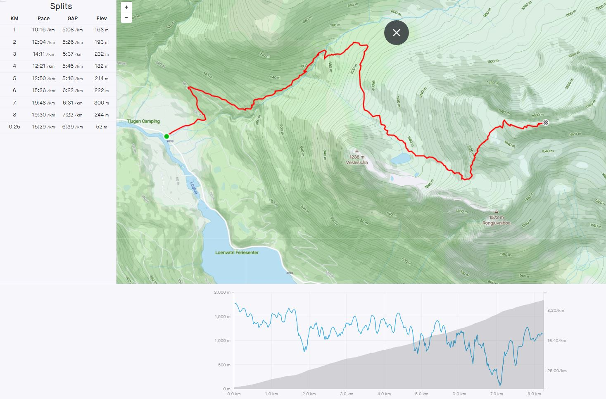
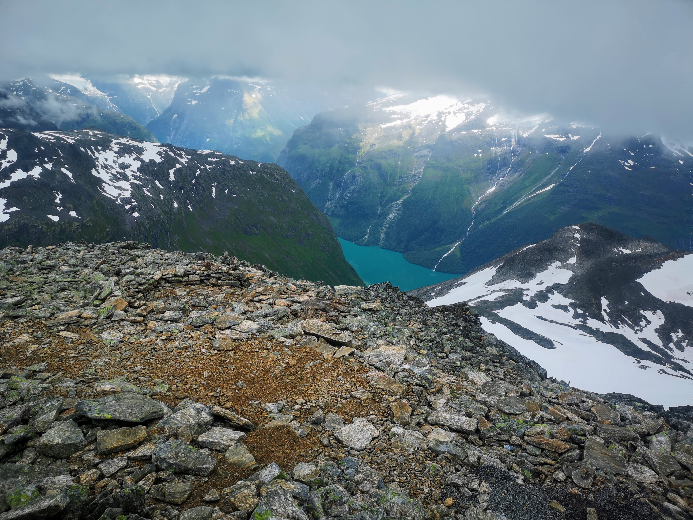
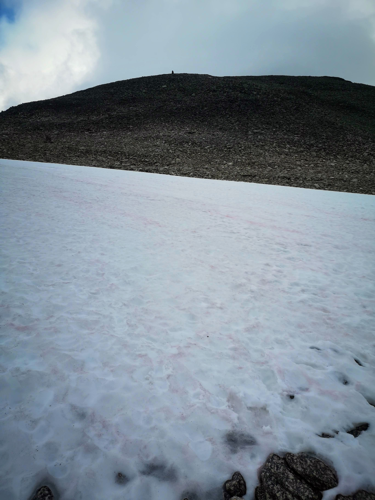
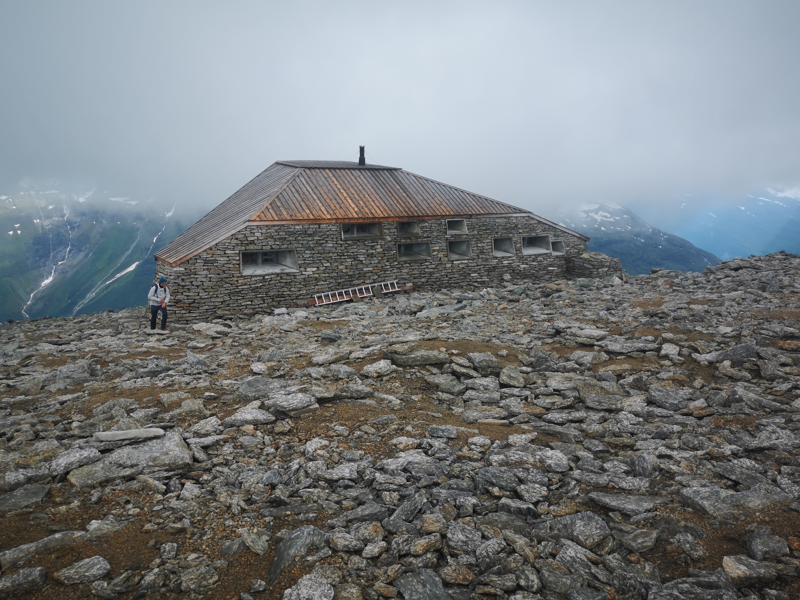
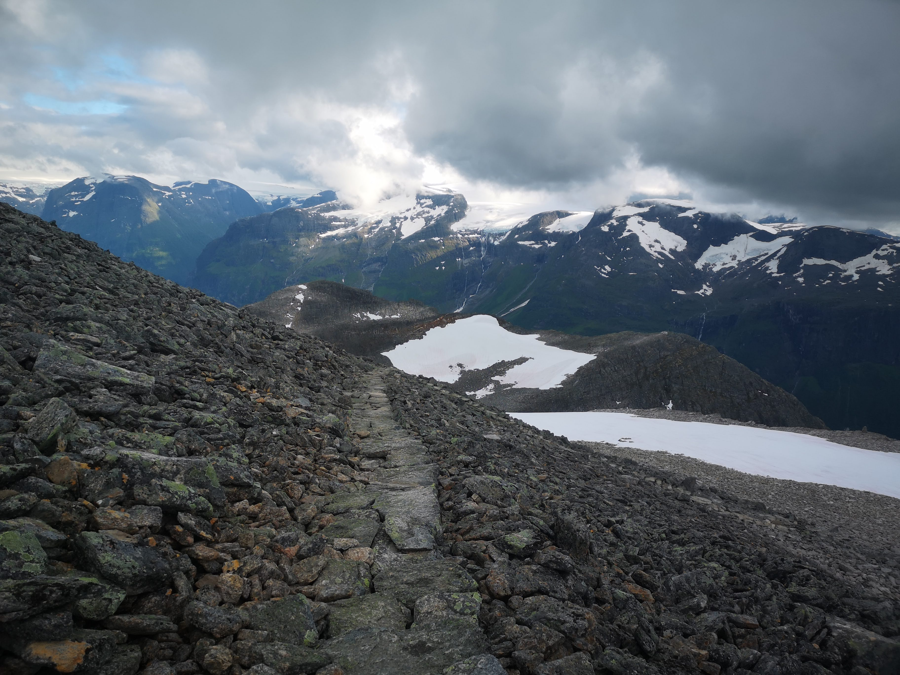
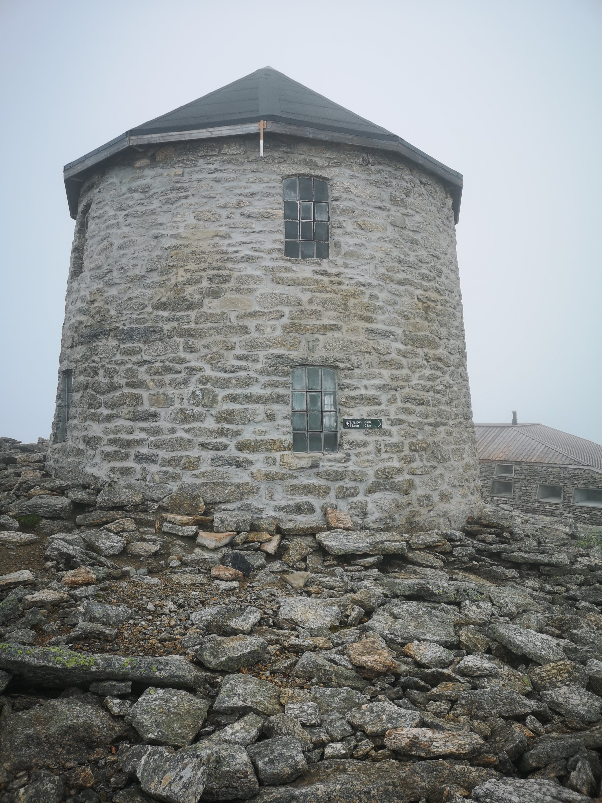

Skåla blir kaldt norges lengste motbakke. Den ligger i Vestland fylke i regionen Nordfjord. Innerst i fjorden med samme navn som regionen "Nordfjord"  finner vi turistbygda Loen. Turen til Skåla starer i denne lille bygda som ligger omsluttet av høye majestetiske fjell, grønne enger og hvitegrønne isbreer. De satser stort på turistme og de siste tilskuddene er gondolbane og Via Ferata rute opp til Hoven på 1008 moh. De er ellers kjent for å huse Hotell Alexandria og Nordfjord Kjøtt. 

Etter noen dagers ferie i Florø har jeg fått muligheten til å ta turen til fjellet Skåla på 1848 moh. Denne turen har lenge stått på ønskelisten min. Denne Juli dagen hadde YR lovet lettskyet vær i starten hvor skyene skulle forsvinne i løpet av ettermidagen. Virkligheten var regn på formidagen som etter hvert gikk over i lette regnbyger og tunge skyer. Startet ikke turen opp på Skåla før klokken var nærmere 16:00. 
Turen opp tok jeg som trening og ville ta det rolig ned igjen slik at jeg ikke ødela beina de neste dagene. Etter en times småjogg i sone 2-3-4 innså jeg at dette ble tungt og at jeg ikke kom til å sette noen rekorder annet en min egen. Brukte 2 timer og 3 minutter opp inklusiv noen mindre pauser i ulike bekker for å fylle på vann.

Rekorden for herrer er 1 time og 7 minutter som etter å ha fullført turen er imponerende. <a target="_blank" rel="noopener noreferrer" href="https://www.skaala.no/resultat" style="color: blue"> LINK Resultater Skåla opp </a> Løpet Skåla opp arrangeres hvert år i august og det deltar ca 1000 personer.  Hvis du logger turen din på Strava får du automatisk segmentet opp og kommer på Strava sin resulatliste .  Hvis du har tilgant til Strava kan du følge denne linken  <a target="_blank" rel="noopener noreferrer" href="https://www.strava.com/segments/2157945?filter=overall" style="color: blue"> Strava resultater </a>

Nede i dalen var det 18 varmegrader, når jeg nærmet meg toppen ca 1500 moh begynte det å blåse og temperaturen sank kraftig. De som kom imot meg nedover hadde på seg lue , jakker og våtter. Ettervert forvant jeg inn i ett tett skylag hvor jeg bare kunne se stien forran meg. Da jeg endelig var på toppen viste termometerert 3 varme grader. Jeg satte meg inn i DNT hytten hvor der var godt og varmt i håp om at skyene skulle lette. Etter en halvtime ble der en gløtt igjennom skylaget slik at jeg fikk tatt mine bilder og kunne starte nedoverturen.

Jeg gikk nedover i rolig tempo for å spare lår og knær brukte ca 2:25 med noen(1) korte pauser.

Der er nedlagt mange arbeidstimer med å lage en sammenhengende sti og trapper fra bunn til topp. Dette medfører at en kan gå i lette fjellsko/joggesko hele sommersesongen. 

Nå i midten av juni var der kun en snøfonn igjen på ca 1600 meters høyde

Flott trappetrin hele veien 

