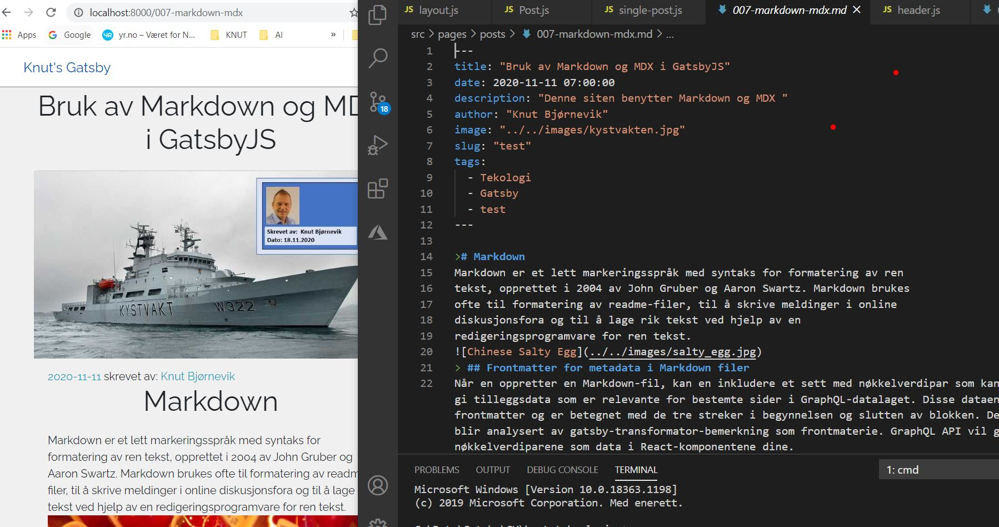

<h2> Markdown </h2>
Markdown er et lett markeringsspråk med syntaks for formatering av ren tekst, opprettet i 2004 av John Gruber og Aaron Swartz. Markdown brukes
ofte til formatering av readme-filer, til å skrive meldinger i online diskusjonsfora og til å lage rik tekst ved hjelp av en 
redigeringsprogramvare for ren tekst.  Alle innleggene i denne bloggen er skrevet i Markdown.

<h2> GatsbyJS bruker GraphQL </h2>
Sentralt i generering av web sider er GraphQ som benyttes for å hente data . 
<a target="_blank" rel="noopener noreferrer" href= "https://www.gatsbyjs.com/tutorial/part-five/#introducing-graphiql" > Introduksjon GraphQL</a>
Hvis du er kjent med SQL, fungerer det på en lignende måte men annen syntaks. Ved hjelp QL-syntaksen beskriver du dataene du vil ha i komponenten din.

<h2> Headless CMS </h2>
The term “Headless” indicates a lack of a frontend. Headless CMS bruker API-kall for å flette markdown filene inn i en webside
Problem:
Etter å ha laget denne bloggen basert på markdown i flettede filer ønsket jeg å benytte blogteksten(markdown) i flere programmer/løsninger. 
Dette er vanskelig når programkoden, markdown filene og bildene er bundlet sammen slik jeg laget første versjon. 
Mine krav er:
1. Jeg må få skilt datane(Markdown filene) fra programkoden.
2. REACT. Ønsker å benytte primært React som front end verktøy. Ikke skaldelig om også andre verktøy støttes
3. GraphQL Må kunne gjenbruke koden i allerede i denne bloggen  
4. Multi kanal publisering. Må kunne publisere innholdet til flere kanaler.
5. CMS leverandøren må ha et redigeringsverktøy slik at jeg kan redigere innholdet i blogpostene.Rich content editor

Løsning:
Etter noe resarch fant jeg ut at der er noe som kalles Headles CMS.

Headles CMS er et back-end  content management system (CMS), Det er en database hvor innholdet gjøres tilgjengelig via en RESTful API eller 
GraphQL API for visning på en hvilken som helst enhet. 

<h2>Frontmatter for metadata i Markdown filer</h2>
Når en oppretter en Markdown-fil, kan en inkludere et sett med nøkkelverdipar som kan brukes til å gi tilleggsdata som er relevante for bestemte sider i GraphQL-datalaget. Disse dataene kalles frontmatter og er betegnet med de tre streker i begynnelsen og slutten av blokken. Denne blokken blir analysert av gatsby-transformator-bemerkning som frontmaterie. GraphQL API vil gi nøkkelverdiparene som data i React-komponentene dine.

<a target="_blank" rel="noopener noreferrer" 
href= "https://www.gatsbyjs.com/docs/adding-markdown-pages" > Link Gatsby Markdown Pages</a>

>## MDX i Gatsby
Standard Markdon har sine begrensinger og jeg har derfor oppgradert siten til å benytte MDX. MDX er et supersett av Markdown som lar oss
 legge inn JSX direkte i Markdown-filer.
<a target="_blank" rel="noopener noreferrer" href= "https://www.digitalocean.com/community/tutorials/gatsbyjs-mdx-in-gatsby" > Link artikkel om MDX </a>

npm install gatsby-remark-images gatsby-plugin-sharp

Lage grafer i MDX filer https://recharts.org/en-US/examples
<a target="_blank" rel="noopener noreferrer" href= "https://recharts.org/" > Link artikkel om recharts </a>
