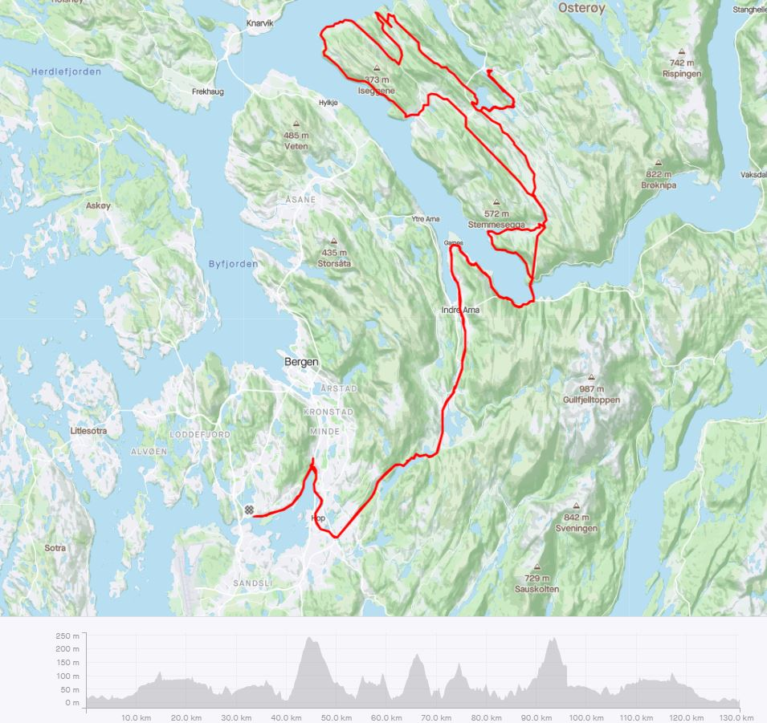
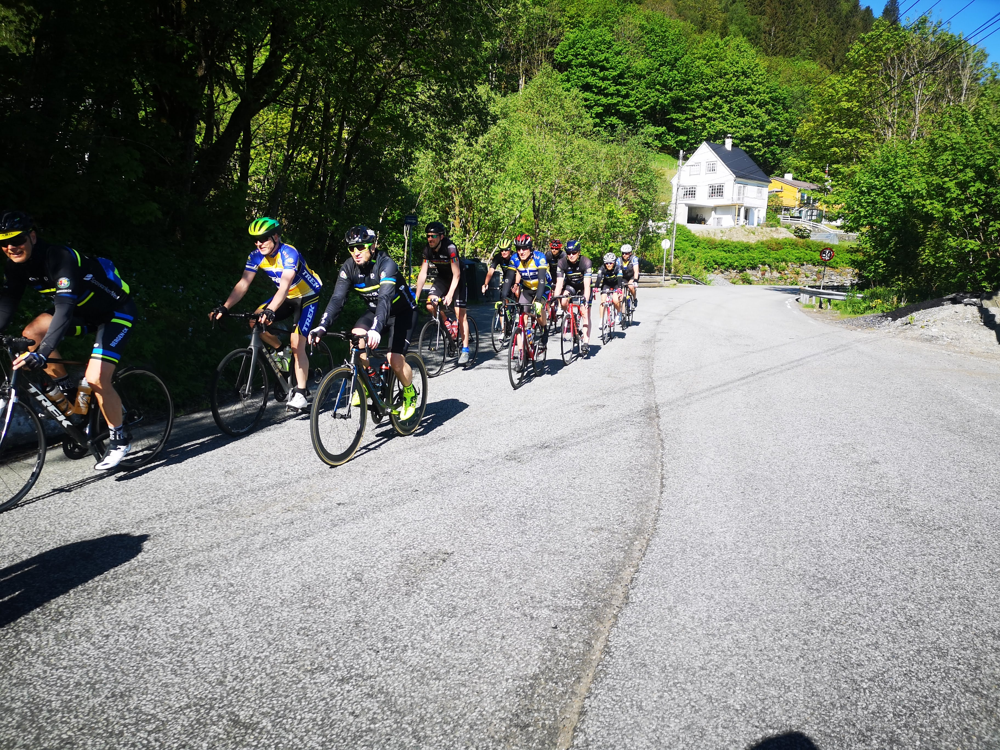
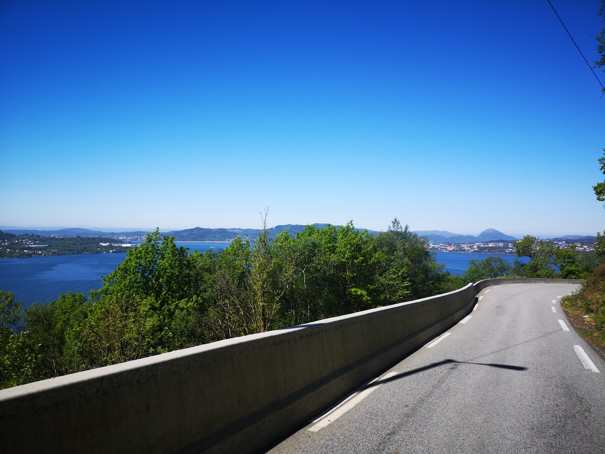
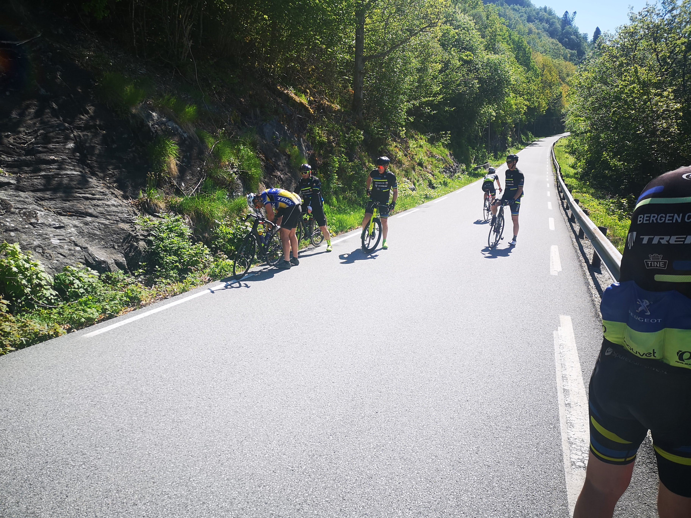
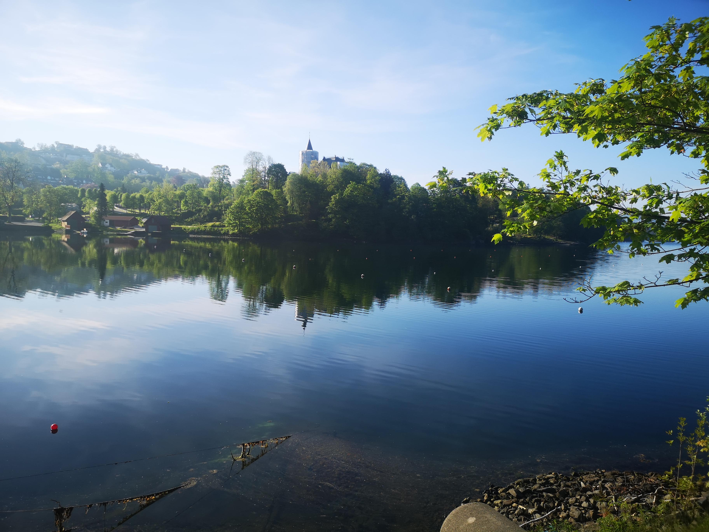

<h1>Osterøy en perle for syklister.</h1>

En lørdag i slutten av Mai 2021  hadde jeg enn fantastisk tur til Osterøy med Bergen CK 4.50 
gruppen. Dette var kanskje årets flotteste dag så lang. Osterøy er Norges største innenlands øy slik at vi kom ikke over hele øyen med tiden vi hadde satt av.
Vi valgte oss  Haus,  Valestrandsfossen, videre helt nord på øyen så vi så over til Nordhordalandsbroen
 , deretter over til Lonevåg for lunsj.  Etter mat og drikke ble det strakaste vegen hjem. 
 Ca. 130 km alt etter hvor man bor i Bergen

<i>Ruten vi fulgte til Osteroy</i>

<i>På vei mot osteroy</i>

<h2>Osterøy er en perle for syklister.</h2>
Er helt sikker på at denne øyen ville blidt rangert høyt opp som sykkel attraksjon sammenlignet med mange mål i Vest-Europa.  
Veinettet er småkupert med smale trivelige veier som veksler mellom tett skog, gårdsdrift og bakketopper med en fantastisk malerisk utsikt. 

<h2>Bergen CK sin 4.50 gruppe</h2>
Bergen CK sin 4.50 gruppen er en fantastisk gjeng, velorganisert og kjører i et fornuftig tempo. 
De er godt organisert for de som skal ha en rolig langtur. 
På toppen av bakkene ble det ventet på at også "alle" var med før man satte opp farten.
Denne gruppen kjører årlig sammen til Bergen-Voss og har felles treningsøkter. 

Turen gikk uten større tekniske problemer vi hadde 2 punktering. (noe uvanlig med dagens dekk) 
Lunsjen ble tatt ved Extra Lonevåg da kafeteriaen var stengt. Der stod noen benker 100 meter fra butikken.
Lørdagen hadde jeg enn fantastisk tur fra Bergen til Osterøy med Bergen CK 4.50 gruppen, 
i kanskje årets flotteste dag så lang.

Osterøy burde blidt benyttet mye mere til sykkelturer. 

Bilde start fra Fjøsanger

