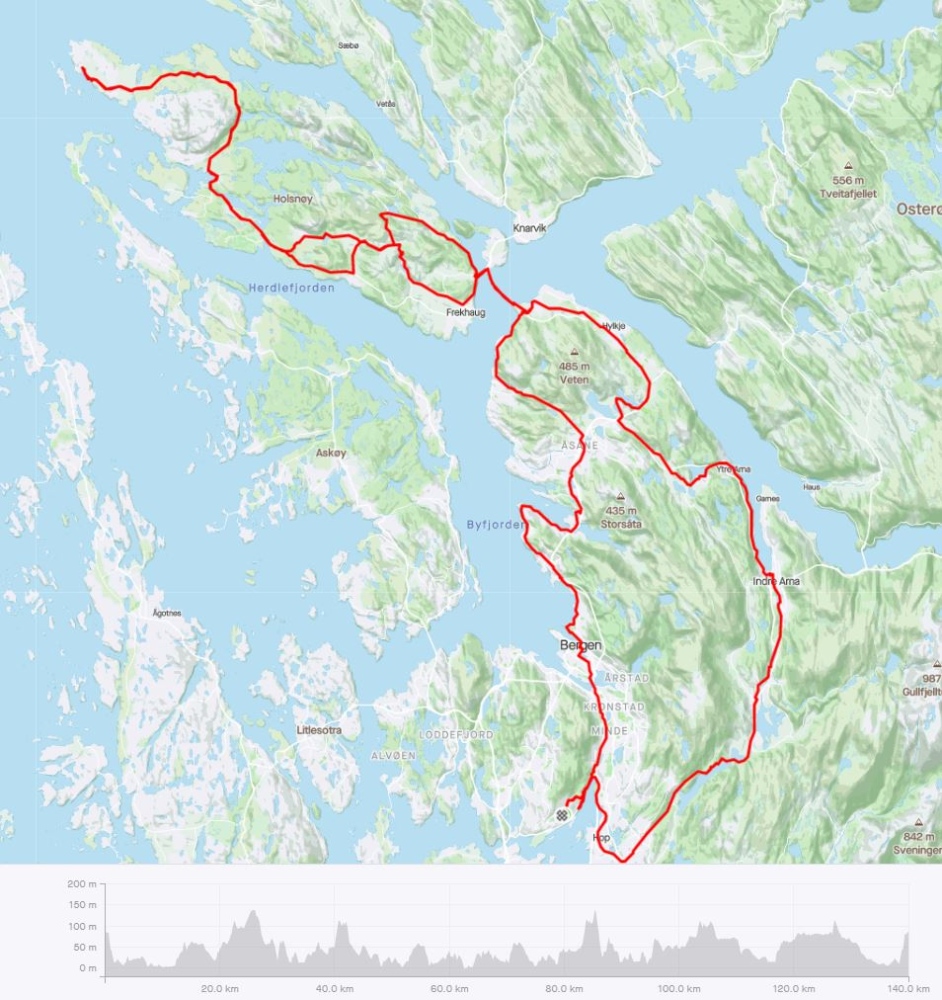
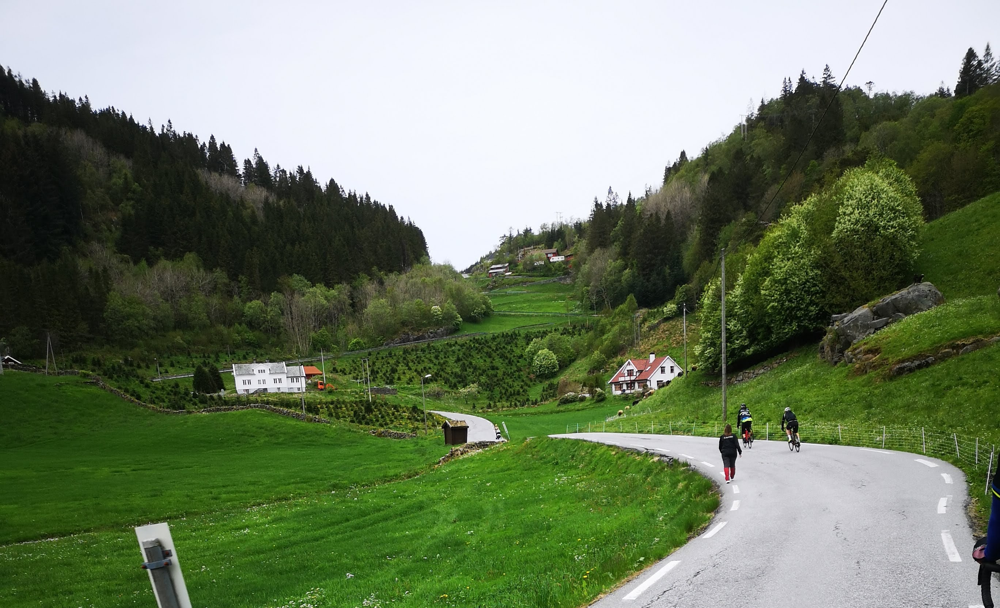
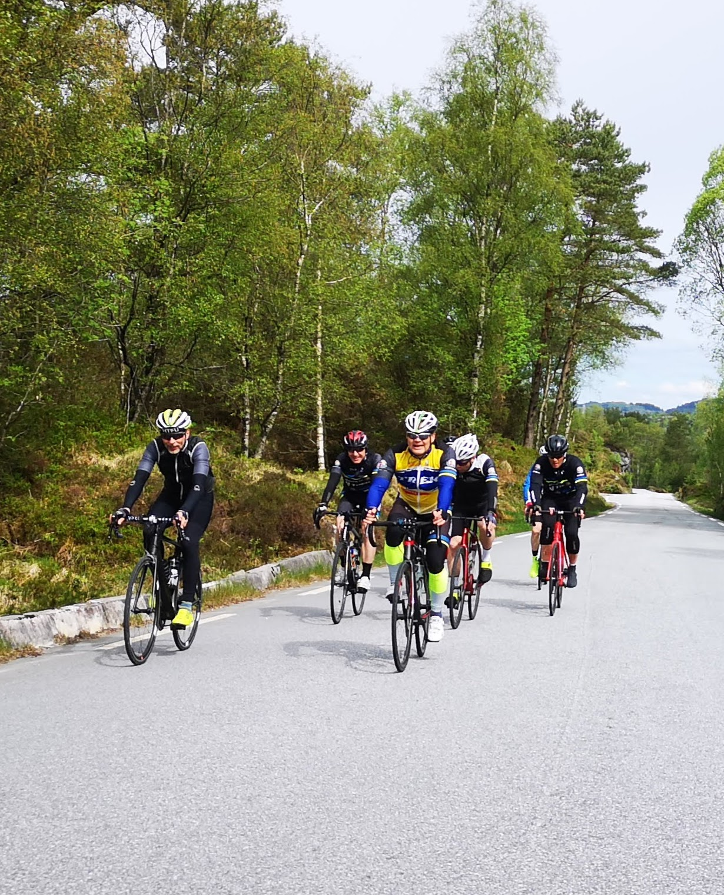

Hvis du ser etter en dagstur på sykkel med ugangspunkt i Bergen kan man ta en tur til Skjelang helt nord på Holsenøy.
Dette var tidligere en egen kommune Meland men er nå en del av Alver kommune.
Jeg har syklet i Bergen i en årrekke men aldri tatt turen til Holsenøy. Jeg ble gledelig overrasket over øyen. Straks du kommer inn over øyen kommer man til et typisk vestnorsk landbruksdistrikt med små og smale bygdeveier og gårdsbruk tett i tett.
Veiene er småkuperte uten de høyeste fjell men alikevel bratte nok til at der er noen strava segmenter å konkurrere på.
 

Hele turen er på 140 Km.
 <a target="_blank" rel="noopener noreferrer" href="https://www.strava.com/activities/5338506814">Link til Strava Rute </a>

Vi var en gjeng fra Bergen Cycle Club på 9 stykker.  Ute på øyen traff vi en rekke andre syklister inklusiv en gjeng fra Åsane cykkelklubb.

Vi tok oss 5 minutter på kaien ved Skjelanger før vi snudde.
Helt nord på øyen kom vi ikke da den var avsperret av forsvarsanelgg.

 

 <a  target="_blank" rel="noopener noreferrer" href="https://photos.app.goo.gl/y6mTGwprCuAaGjcG6"> Link til flere Bilder </a>

